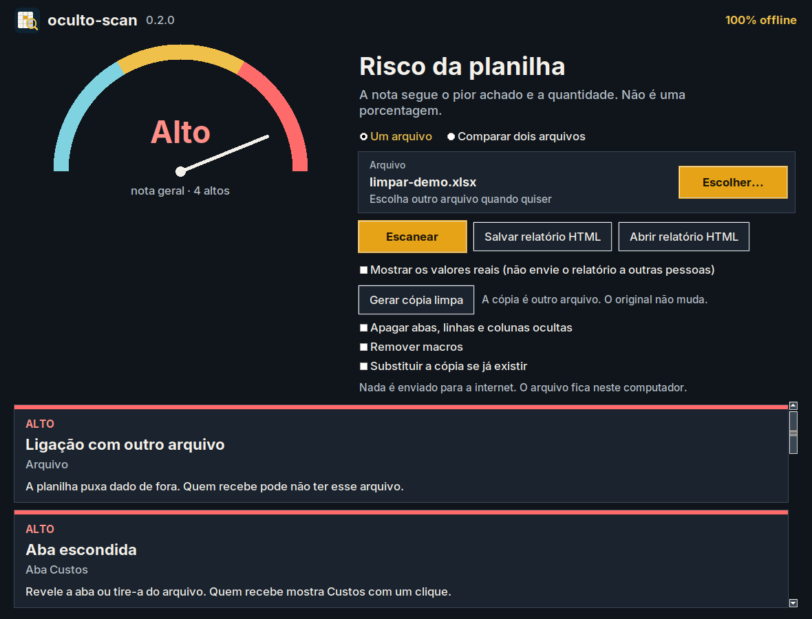
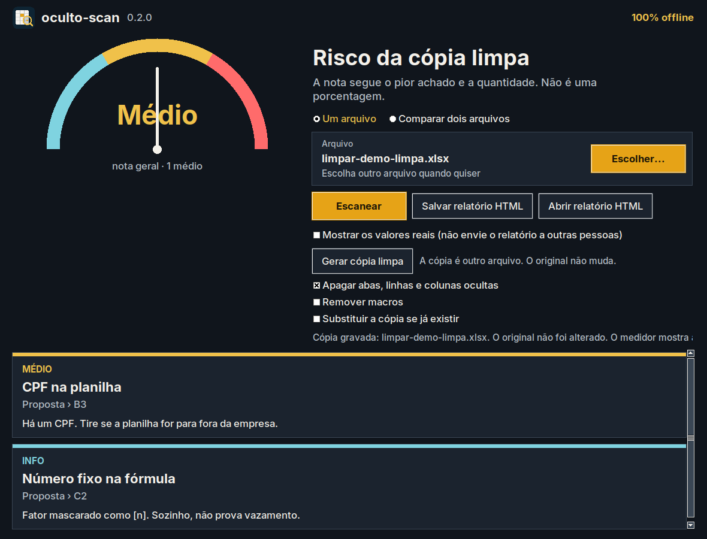

<p align="center">
  
</p>

<h1 align="center">oculto-scan</h1>

<p align="center"><strong>Ache o que vaza na planilha antes de enviar a proposta</strong></p>

<p align="center">
  <a href="https://github.com/HendersonGomes/oculto-scan/actions/workflows/ci.yml"></a>
  <a href="https://github.com/HendersonGomes/oculto-scan/releases/latest"></a>
  <a href="https://github.com/HendersonGomes/oculto-scan/blob/main/LICENSE"></a>
</p>

<p align="center">
  <a href="https://github.com/HendersonGomes/oculto-scan/releases/latest/download/oculto-scan-setup.exe"></a>
</p>

<p align="center"><strong>100% offline · grátis · open source</strong></p>

<p align="center">Quem prefere não instalar baixa o <a href="https://github.com/HendersonGomes/oculto-scan/releases/latest/download/oculto-scan.exe">oculto-scan.exe portátil</a>. Ele abre só a janela, sem a janela preta do terminal. O <a href="https://github.com/HendersonGomes/oculto-scan/releases/latest/download/oculto-scan-cli.exe">oculto-scan-cli.exe</a> é o mesmo programa na linha de comando.</p>

<p align="center">
  
</p>

Lê a planilha de proposta, medição, orçamento ou laudo (`.xlsx` e `.xlsm`) **antes** do envio e junta, num lugar só, o que um engenheiro olharia na pasta.

**nenhum achado não significa arquivo limpo.**

## O que ele encontra

| | |
| --- | --- |
| 🙈 | Abas, linhas e colunas ocultas, e a fórmula visível que puxa essa área |
| 💬 | Comentários e notas |
| 🪪 | CPF, CNPJ, PIS e dado bancário com contexto |
| 🗂️ | Caminho de rede, usuário do Windows, SharePoint e impressora |
| 👤 | Metadados: autor, empresa e último editor |
| 🔗 | Vínculos externos e hiperlinks (anotados, nunca abertos) |
| ⚙️ | Macros (lidas, nunca executadas) |
| 🔑 | Senha, token e chave |

A tabela de risco está em [Uso](docs/uso.md#o-que-a-ferramenta-detecta).

## Novo na v0.2: cópia limpa

**Gerar cópia limpa** grava outro arquivo (`proposta-limpa.xlsx`). O original não muda.

Saem comentários, autor, empresa, dado pessoal nos metadados e vínculos externos. Aba oculta e macro só saem se você marcar.

CPF e senha dentro da célula ficam para revisão humana. O medidor passa a mostrar o risco da cópia.

<p align="center">
  
  
</p>

Regras: [Limpar uma cópia](docs/uso.md#limpar-uma-copia).

## Como usar em 3 passos

1. **Baixe** o `oculto-scan-setup.exe` no botão acima.
2. **Abra** o instalador. O atalho do menu Iniciar abre a janela.
3. **Escolha** a planilha e clique em **Escanear**.

Se o SmartScreen disser que o aplicativo não é reconhecido, clique em **Mais informações** e depois em **Executar assim mesmo**: a assinatura ainda não está ativa. Para atualizar, baixe o setup novo e instale por cima.

Hash, desinstalar e o caminho sem terminal: [Guia para iniciantes](docs/guia-iniciante.md).

## Para quem usa terminal

```bash
python -m pip install -e ".[macro]"
oculto-scan proposta.xlsx
```

No Windows, `oculto-scan gui` usa o `pythonw` e não abre o console. Comandos, `diff`, ignore e códigos de saída: [Uso](docs/uso.md).

## Privacidade

Nada sai do computador. Não há telemetria nem cliente de rede: a planilha é lida aqui e o relatório fica neste disco.
A macro não é executada e o vínculo externo não é aberto.

## Feito com

<p align="center">
  
  
  
  
  <br>
  
  
  
  
</p>

Desenvolvido por Henderson Gomes · NeoRise Technology, com auxílio de ferramentas de IA.

## Apoie

Checagem de arquivo antes do envio e apoio ao projeto: [GitHub Sponsors](https://github.com/sponsors/HendersonGomes). O contato também é pelo [perfil no GitHub](https://github.com/HendersonGomes) ou pelo perfil dele no LinkedIn.

Dúvidas: use o menu Ajuda > Contato da janela ou [abra uma issue](https://github.com/HendersonGomes/oculto-scan/issues).

## Comunidade

[Contribuir](CONTRIBUTING.md) · [Código de conduta](CODE_OF_CONDUCT.md) · [Segurança](SECURITY.md) · [Política de assinatura de código](docs/code-signing-policy.md)

## Licença e créditos

Apache-2.0. Veja [LICENSE](LICENSE) e [NOTICE](NOTICE).

- [tarja](https://github.com/macmaia/tarja), Maria Alice Maia — CPF, CNPJ (inclusive alfanumérico) e PIS/NIS. Apache-2.0.
- [defusedxml](https://github.com/tiran/defusedxml) — leitura de XML hostil.
- [gitleaks](https://github.com/gitleaks/gitleaks) — padrões de token sob MIT, com atribuição no `NOTICE`. A regra de `senha` é deste projeto.
- [oletools](https://github.com/decalage2/oletools) — leitura estática de macro. BSD. A macro não é executada.
- [PyInstaller](https://pyinstaller.org) — só para montar o `.exe` de Windows. O executável não usa UPX.

O oculto-scan não substitui revisão humana nem assessoria jurídica. Não publica pacote no PyPI. Não é ferramenta de invasão.

## Mais documentação

- [Guia para iniciantes](docs/guia-iniciante.md) — baixar, hash, passo a passo e planilha de demonstração
- [Uso](docs/uso.md) — instalação, atualizar, comandos, cópia limpa, diff, exemplo e ignore
- [Limitações](docs/limitacoes.md)
- [Segurança da ferramenta](docs/seguranca-da-ferramenta.md)
- [Roteiro](docs/roteiro.md)
